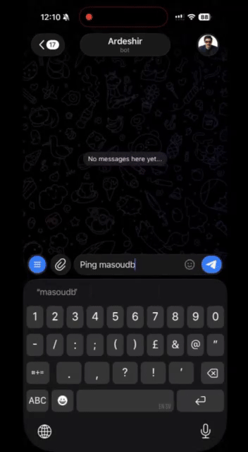
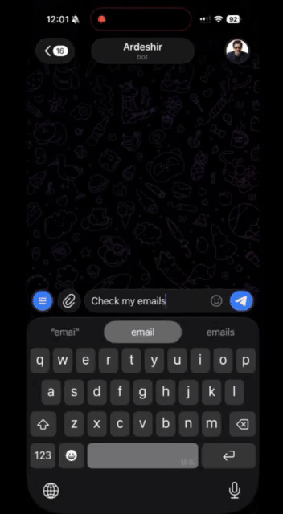

<p align="center">
  
  
  
  
</p>

<p align="center">
  
  
</p>
<p align="center">
  
  
</p>

<h1 align="center">Pocket Assistant AI</h1>

<p align="center">
  <strong>Your personal AI assistant that lives in your pocket.</strong><br/>
  Multi-agent AI with browser automation, coding, voice input, persistent notepads, and smart scheduling—including optional genius-mode reasoning for complex tasks.
</p>

<p align="center">
  <a href="#features">Features</a> •
  <a href="#architecture">Architecture</a> •
  <a href="#quick-start">Quick Start</a> •
  <a href="#docker">Docker</a> •
  <a href="#configuration">Configuration</a> •
  <a href="#observability">Observability</a>
</p>

---

## What is Pocket Assistant AI?

Pocket Assistant AI is an intelligent personal assistant that runs on Telegram. It remembers your conversations, learns your preferences, and can perform complex tasks like browsing the web, writing code, and managing your schedule.

Unlike simple chatbots, Pocket Assistant uses a multi-agent architecture with persistent memory and optional high-capability reasoning:

- **Main Agent** — Orchestrates conversations, routes tasks, and can use a **genius model** for complex reasoning when you ask for it
- **Browser Agent** — Automates web browsing with intelligent planning
- **Coder Agent** — Writes, edits, and manages code projects
- **Notepads** — Persistent notes and data logs so the assistant remembers context and outcomes across runs and scheduled tasks

---

## Prompt Examples

These are real prompts you can **copy, paste, and tweak** to see what Pocket Assistant AI can do.

### Scheduling

```
You: Remind me to call mom tomorrow at 3pm
Bot: Schedule created! I'll remind you tomorrow at 3:00 PM.

You: Every Monday at 9am, remind me about standup
Bot: Recurring schedule created for every Monday at 9:00 AM.

You: Every day at 9am analyze my portfolio and summarize, use genius mode
Bot: Schedule created with genius mode — I'll use the high-capability model for the analysis and keep notes in the schedule notepad.
```

### Notepad (persistent context)

The assistant can create and update notepads to remember data across runs. Scheduled tasks get their own notepad automatically; you can also ask it to track ad-hoc data.

```
You: Track the BTC price in a notepad and tell me when it crosses 100k
Bot: I'll create a notepad and update it when we check the price...
     [Later runs read the notepad and see history]
```

### Browser Tasks

```
You: Go to Hacker News and tell me the top 3 stories
Bot: I'll browse Hacker News for you...
     [Takes screenshots, extracts information]
     Here are the top 3 stories: ...
```

### Coding

```
You: Clone github.com/user/repo and add a README file
Bot: Starting coding task...
     Using project folder: repo
     Cloning repository...
     Creating README.md...
     Done! Created README.md with project description.
```

### Voice Input

```
You: [Send a voice message saying "What's the weather like today?"]
Bot: Voice transcribed: "What's the weather like today?"
     Processing...
     [Bot responds to your question]

You: Transcribe this for me
You: [Send a voice message]
Bot: Transcription:
     [Your spoken words as text]
```

### API Calls

```
You: Check if api.github.com is up
Bot: HTTP 200 OK
     {"current_user_url":"https://api.github.com/user"...}
```

### Example prompts (copy & paste)

You can send these as-is to create powerful scheduled or one-off tasks. Customize times and URLs to your needs.

**Daily crypto analysis (browser + genius model + notepad)**

Create a schedule that runs every morning, opens CoinGecko, captures the page, and uses the genius model for professional-style analysis:

```
Every morning at 9:35:

Act as a senior and professional crypto trader:

1. Open https://www.coingecko.com/en/coins/bitcoin in the browser
2. Take a screenshot and extract all the data (chart situation, current price, and all other important data)
3. Use genius model to analyse it as a professional crypto trader
4. Give me a short message including comparison, signal and prediction
```

The bot will create a recurring schedule with genius mode, use the browser agent to capture the page, and the schedule notepad to keep context (e.g. previous price, trend) across runs.

---

## Features

### Intelligent Conversations
- Powered by LLMs via OpenRouter (supports GPT-4, Claude, Gemini, DeepSeek, and more)
- **Two-layer memory**: short-term conversation history plus long-term semantic memory for important facts and preferences
- Semantic search enriches context by retrieving relevant past conversations and stored facts
- **Genius model** — optional high-capability model for complex reasoning (e.g. scheduled analysis); enable per task with "use genius mode"
- Learns your preferences through the "Soul" personalization system

### Browser Automation
- Plans and executes complex web tasks step by step
- Takes screenshots and extracts information from pages
- Handles dynamic content, forms, and multi-step workflows
- Built on **standalone Playwright** for reliable full-browser control
- Also supports **Browser MCP** (`browsermcp.io`) so you can run the same browser tools in MCP-compatible environments

### Code Assistant
- Clone repositories and work on code projects
- Read, write, and edit files with intelligent context
- Search code with grep, manage git branches
- Run commands and build scripts
- Real-time progress updates as it works

### Smart Scheduling
- Natural language: "Remind me tomorrow at 5pm"
- Recurring tasks with cron expressions
- **Genius mode** — optionally use a high-capability model (e.g. DeepSeek V3) for complex scheduled reasoning (analysis, trends, decisions)
- Automatic cleanup of old schedules
- Context-aware reminders
- Each schedule has a **persistent notepad** so the agent remembers context and outcomes across runs

### Notepad — Persistent Agent Memory
- **Cross-run memory** — the AI maintains notepads (notes, key-value state, time-series data logs) that persist across conversations and scheduled runs
- Perfect for tracking metrics, decisions, and context (e.g. "last price", "trend", "what we decided")
- Used automatically by scheduled tasks; also available as tools (`listNotepads`, `readNotepad`, `updateNotepad`) for ad-hoc tracking
- Organize by category; scannable, concise storage so the agent stays in context without clutter

### Voice Input
- Send voice messages and the AI will transcribe and act on them
- Powered by Groq's Whisper large-v3-turbo model
- Say "transcribe this" before sending a voice message to get transcription only
- Fast and accurate speech-to-text conversion

### HTTP Requests
- Make API calls directly from chat
- Support for all HTTP methods
- Custom headers and authentication
- Perfect for checking RSS feeds, APIs, webhooks

### Security
- Whitelist-based access control
- SSRF protection for HTTP requests
- Input sanitization against prompt injection
- Sandboxed code execution environment

---

## Architecture

```
┌─────────────────────────────────────────────────────────────────┐
│                        Telegram Bot                             │
│                     (nestjs-telegraf)                           │
└─────────────────────────────┬───────────────────────────────────┘
                              │
                              ▼
┌─────────────────────────────────────────────────────────────────┐
│                    Messaging Abstraction                        │
│            (IMessagingService - extensible)                     │
└─────────────────────────────┬───────────────────────────────────┘
                              │
                              ▼
┌─────────────────────────────────────────────────────────────────┐
│                        Main Agent                               │
│                    (LangGraph ReAct)                            │
│  ┌──────────┐  ┌──────────┐  ┌──────────┐  ┌──────────┐  ┌──────────┐  ┌────┐ │
│  │  Tools   │  │  Memory  │  │   Soul   │  │ Scheduler│  │ Notepad  │  │State│ │
│  └────┬─────┘  └──────────┘  └──────────┘  └──────────┘  └──────────┘  └────┘ │
└───────┼─────────────────────────────────────────────────────────┘
        │
        ├─────────────────┬─────────────────┐
        ▼                 ▼                 ▼
┌───────────────┐ ┌───────────────┐ ┌───────────────┐
│ Browser Agent │ │  Coder Agent  │ │  HTTP Client  │
│  (Playwright) │ │  (Git + FS)   │ │   (fetch)     │
└───────────────┘ └───────────────┘ └───────────────┘
```

### Key Components

| Component | Description |
|-----------|-------------|
| **Main Agent** | LangGraph-based ReAct agent that handles conversations and routes to sub-agents |
| **Browser Agent** | Plans complex web tasks, executes them step-by-step with standalone Playwright or Browser MCP (`browsermcp.io`) |
| **Coder Agent** | Manages code projects with file operations, git, and command execution |
| **Soul Service** | Stores user preferences and personality settings |
| **Memory Service** | Two-layer memory: conversation history (with summarization) and long-term semantic memory; hybrid search enriches context |
| **Notepad Service** | Persistent notepads per chat: notes, key-values, and time-series data logs so agents remember context and outcomes across runs (used by scheduler and tools) |
| **State Service** | Per-chat key-value state with optional TTL for scheduled tasks and cross-session data |
| **Scheduler** | Handles reminders and recurring tasks with cron support; optional genius model and per-job notepad for complex scheduled reasoning |

---

## Quick Start

### Prerequisites

- Node.js 20+
- A Telegram bot token (from [@BotFather](https://t.me/BotFather))
- An OpenRouter API key ([openrouter.ai](https://openrouter.ai))

### Installation

```bash
# Clone the repository
git clone https://github.com/yourusername/pocket-assistant-ai.git
cd pocket-assistant-ai

# Install dependencies
npm install

# Copy environment template
cp .env.example .env

# Edit .env with your tokens
nano .env
```

### Configuration

Edit `.env` with your credentials:

```env
TELEGRAM_BOT_TOKEN=your_telegram_bot_token
OPENROUTER_API_KEY=your_openrouter_api_key
```

Edit `data/config.json` to add your Telegram user ID (created on first run if missing):

```json
{
  "security": {
    "allowedUserIds": ["YOUR_USER_ID"]
  }
}
```

> Don't know your user ID? Start the bot and send any message - it will show your ID.

### Run

```bash
# Start the app (with hot reload)
npm start
```

### Package scripts

| Script | Description |
|--------|-------------|
| `npm start` | Start the app with watch mode (hot reload) |
| `npm run build` | Compile the NestJS app |
| `npm run browser` | Run the browser helper script (opens Playwright browser) |

---

## Docker

Docker is used only to run **Langfuse** (LLM observability). Run the app locally with `npm start`.

### Start Langfuse (optional)

```bash
docker compose up -d
# Dashboard: http://localhost:31111
```

Then in `.env` set `LANGFUSE_HOST=http://localhost:31111` and add your keys from the Langfuse project settings.

### Build app image (optional)

```bash
docker build -t pocket-assistant-ai .
```

### Environment Variables

| Variable | Required | Description |
|----------|----------|-------------|
| `TELEGRAM_BOT_TOKEN` | Yes | Bot token from BotFather |
| `OPENROUTER_API_KEY` | Yes | API key from OpenRouter |
| `GROQ_API_KEY` | No | Groq API key for voice transcription |
| `ZAPIER_MCP_TOKEN` | No | Zapier MCP integration token |
| `LANGFUSE_PUBLIC_KEY` | No | Langfuse public key for observability |
| `LANGFUSE_SECRET_KEY` | No | Langfuse secret key |
| `LANGFUSE_HOST` | No | Langfuse host URL |
| `ENABLE_API_CHANNEL` | No | Enable REST API alongside Telegram |

---

## Configuration

### data/config.json

Configuration is loaded from `data/config.json` (created with defaults on first run). Example:

```json
{
  "security": {
    "allowedUserIds": ["123456789"]
  },
  "model": "google/gemini-2.0-flash-001",
  "vision_model": "google/gemini-2.0-flash-001",
  "coder_model": "anthropic/claude-sonnet-4",
  "genius_model": "deepseek/deepseek-v3.2"
}
```

### Model Selection

Choose any model from [OpenRouter](https://openrouter.ai/models):

| Role | Purpose | Example |
|------|---------|---------|
| `model` | Main conversations and routing | `google/gemini-2.0-flash-001`, `deepseek/deepseek-v3.2` |
| `vision_model` | Browser and image understanding | `openai/gpt-4o-mini` |
| `coder_model` | Code editing and analysis | `anthropic/claude-sonnet-4`, `google/gemini-2.5-pro` |
| `genius_model` | Complex reasoning (e.g. scheduled analysis, "genius mode") | `deepseek/deepseek-v3.2` |

- **Genius model** is used when you enable "genius mode" on a schedule (e.g. "remind me to analyze trends every morning, use genius mode") for deeper reasoning without slowing everyday chat.

---

## Observability

### Langfuse Integration

Pocket Assistant integrates with [Langfuse](https://langfuse.com) for LLM observability:

- Trace all LLM calls with timing and token usage
- Debug agent reasoning and tool calls
- Monitor costs and performance

#### Using Langfuse Cloud

```env
LANGFUSE_PUBLIC_KEY=pk-lf-...
LANGFUSE_SECRET_KEY=sk-lf-...
LANGFUSE_HOST=https://cloud.langfuse.com
```

#### Self-Hosted Langfuse

The included `docker-compose.yml` runs only Langfuse (and its Postgres). Run the app with `npm start`.

```bash
docker compose up -d
# Dashboard: http://localhost:31111
# In .env: LANGFUSE_HOST=http://localhost:31111
```

---

## Bot Commands

| Command | Description |
|---------|-------------|
| `/start` | Start the bot / Begin setup |
| `/help` | Show help message |
| `/clear` | Clear conversation history |
| `/tools` | List available tools |
| `/profile` | View your profile settings |
| `/schedules` | View scheduled reminders |
| `/resetprofile` | Reset and redo setup |

---

## Project Structure

```
pocket-assistant-ai/
├── src/
│   ├── agent/           # Main agent orchestration
│   ├── ai/              # AI helper services
│   ├── browser/         # Browser automation agent
│   ├── coder/           # Code assistant agent
│   ├── config/          # Configuration management
│   ├── logger/          # Logging and tracing
│   ├── memory/          # Conversation + long-term memory, embeddings, semantic search
│   ├── messaging/       # Messaging abstraction layer
│   ├── model/           # Model factory (main, vision, coder, genius)
│   ├── notepad/         # Persistent notepads (notes, key-values, data logs) per chat
│   ├── prompts/         # Prompt templates (YAML)
│   ├── scheduler/       # Task scheduling (cron, genius mode, schedule notepads)
│   ├── soul/            # User personalization
│   ├── state/           # Per-chat key-value state (TTL support)
│   ├── telegram/        # Telegram integration
│   ├── usage/           # Token usage tracking
│   └── utils/           # Utilities and sanitization
├── data/
│   ├── config.json      # Application config (created on first run)
│   ├── prompts/         # YAML prompt files
│   └── {userId}/        # Per-user: memory, longterm-memory, state, schedules, notepads/, soul, etc.
├── docker-compose.yml   # Langfuse only (port 31111)
└── Dockerfile           # Production container
```

---

## Extending

### Adding New Messaging Channels

The messaging layer is abstracted via `IMessagingService`. To add a new channel (e.g., REST API, Discord):

1. Create a new service implementing `IMessagingService`
2. Register it in `MessagingModule`
3. Set `ENABLE_API_CHANNEL=true` for multi-channel mode

See `src/messaging/api-messaging.service.ts` for an example.

### Adding New Tools

Edit `src/agent/tools.service.ts`:

```typescript
private createMyNewTool(chatId: string) {
  return tool(
    async (input: { param: string }) => {
      // Your tool logic
      return 'Result';
    },
    {
      name: 'myNewTool',
      description: 'What this tool does',
      schema: z.object({
        param: z.string().describe('Parameter description'),
      }),
    },
  );
}
```

### Custom Prompts

Prompts are stored in `data/prompts/*.yaml` and support hot-reload:

```yaml
# data/prompts/main-agent.yaml
base: |
  You are a helpful AI assistant...

capabilities:
  browser: |
    You can browse the web using executeBrowserTask...
```

---

## Tech Stack

- **[NestJS](https://nestjs.com/)** - Node.js framework
- **[LangChain](https://js.langchain.com/)** - LLM framework
- **[LangGraph](https://langchain-ai.github.io/langgraphjs/)** - Agent orchestration
- **[Telegraf](https://telegraf.js.org/)** - Telegram bot framework
- **[Playwright](https://playwright.dev/)** - Browser automation
- **[OpenRouter](https://openrouter.ai/)** - LLM API gateway
- **[Langfuse](https://langfuse.com/)** - LLM observability


